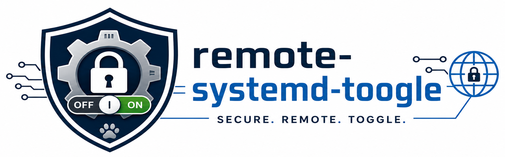

# 🔐 remote-systemd-toggle

[](LICENSE)
[](tree/master)
[](tree/master)
[](https://github.com/tkn777/remote-systemd-toggle/releases)

<p align="left">
  
</p>

---

## ℹ️ Description

`remote-systemd-toggle` is a small Go client/server tool for toggling a
configured systemd service remotely.

It uses TLS 1.3 with mutual TLS, an additional password check, and Argon2id for
password storage. The server is intended to run as root because it calls
`systemctl` directly.

---

## 🧩 Components

- `remote-systemd-toggled`: TLS server
- `remote-systemd-toggle`: TLS client
- `common`: shared config and wire protocol code

---

## 🛡️ Security Model

The server is designed to be reachable over an untrusted network, but only with
strict authentication:

- TLS 1.3 only
- mutual TLS is required
- the server verifies the client certificate against `TLS.client-ca-cert`
- the server can additionally verify the client certificate CN with `TLS.client-cn`
- the client verifies the server certificate using system CAs plus optional `TLS.server-ca-cert`
- toggle and status requests both require mTLS and the password
- every parsed request returns one status response after mTLS; wrong passwords return `unauthorized`
- passwords are read through a hidden prompt unless `--password` is used for scripts
- passwords are never logged
- password bytes are wiped after use where practical
- the password hash is stored as Argon2id parameters plus salt/hash in YAML
- the `secrets.yml` file is written with `0600`
- the server config directory is corrected to `0700`
- the server config and `secrets.yml` file are corrected to `0600`

After wrong passwords, the server waits increasingly longer:

```go
delay = wrong_attempts * wrong_attempts * 3 minutes // '3 minutes' can be changed in config
```

On the tenth *(can be changed in config)* wrong password, the server disables and stops itself with `systemctl`. (In `--dev` mode it only logs what it would do, does not wait after wrong passwords, and exits at the limit.)

---

## ⬇️ Installation (client and server)

1) Get a binary from a release or from the Debian repository, or build one from source.
2) Create certificates, optionally using `cert-generation-examples/` (for production, you only need to generate client certificates).
3) Create the configuration file, optionally using `config-examples/` as a template.

Detailed instructions for each step are provided in the sections below.

---

## 🚀 Usage

### 🖥️ Server

1) Enable the systemd unit to run the server (see below).
2) Set a password using `remote-systemd-toggled --passwd` (see below).

### 💻 Client

1) `remote-systemd-toggle` connects to the configured server, toggles the configured service, and prints the new status.
2) `remote-systemd-toggle --status` connects to the configured server and prints the current status: `active`, `inactive`, `failed`, or `unknown`.
3) The client prompts for a password and sends one authenticated request to the server.\
   For scripts, the client also accepts `--password <password>` and skips the prompt.
4) If authentication fails, the client prints `unauthorized`.
5) The server accepts one connection at a time, reads one request, verifies the password, and then executes the requested command.\
   If the password is wrong, the server waits increasingly longer and eventually disables and stops itself.

---

## 📦 Release Artifacts

GitHub releases provide Debian packages, Red Hat compatible RPM packages, and a Windows client binary.

- The Linux packages are built for `amd64` and `arm64`. 
- The Windows artifact contains the client only.

If you need support for other architectures, just open an issue.

#### 🗄️ Debian Repository

You can use the Debian repository provided by `thk-systems.net` to receive automatic updates (currently only amd64):

```bash
curl -fsSL https://debian.thk-systems.net/repo-install.sh | sudo sh
sudo apt install remote-systemd-toggle-server  (or/and)
sudo apt install remote-systemd-toggle-client
```

---

## 🔨 Build

First get a source code tarball from a release, or clone the repository.

#### Build the client:

```bash
go build -o remote-systemd-toggle ./remote-systemd-toggle
```

#### Build the server:

```bash
go build -o remote-systemd-toggled ./remote-systemd-toggled
```

#### Cross-compile the client for Windows:

```bash
GOOS=windows GOARCH=amd64 go build -o remote-systemd-toggle.exe ./remote-systemd-toggle
```

---

## 📜 Certificates

It is recommended practice to store self-generated certificates in the configuration directory or in a subdirectory below it.

OpenSSL helper scripts are provided in `cert-generation-examples/`.

#### Create a client CA and client certificate:

```bash
./cert-generation-examples/create-client-cert.sh client-certs remote-systemd-toggle-client
```

#### Create a server CA and server certificate for development:

```bash
./cert-generation-examples/create-server-cert.sh server-certs server.example.org
```

For production servers, a public CA certificate such as a certbot certificate is
usually preferable for the server certificate. The client certificate should
still be issued by your private client CA.

---

## ⚙️ Configuration

The client searches:

```text
~/.config/remote-systemd-toggle/config-client.yml
~/.remote-systemd-toggle/config-client.yml
/etc/remote-systemd-toggle/config-client.yml
```

The server searches:

```text
~/.config/remote-systemd-toggle/config-server.yml
~/.remote-systemd-toggle/config-server.yml
/etc/remote-systemd-toggle/config-server.yml
```

If you are using Windows, create a `.config` or `.remote-systemd-toggle` directory in your user's home directory.

Example configs are in `config-examples/`.

### 💻 Client Config

```yaml
Server:
  address: server.example.org
  port: 47112   # optional, default 47112
  timeout: 5    # optional, default 5 seconds

TLS:
  cert: /home/<user>/.config/remote-systemd-toggle/client.crt
  key: /home/<user>/.config/remote-systemd-toggle/client.key
  server-ca-cert: /home/<user>/.config/remote-systemd-toggle/server-ca.crt   # optional, extends system CAs
```

(see above how to create certificates)

### 🖥️ Server Config

```yaml
Server:
  listen: 0.0.0.0                   # optional, default 0.0.0.0
  port: 47112                       # optional, default 47112
  timeout: 5                        # optional, default 5 seconds
  wrong-password-limit: 10          # optional, default 10
  wrong-password-delay-minutes: 3   # optional, default 3

TLS:
  cert: /etc/letsencrypt/live/vpn.example.org/fullchain.pem
  key: /etc/letsencrypt/live/vpn.example.org/privkey.pem
  client-ca-cert: /etc/remote-systemd-toggle/client-ca.crt
  client-cn: remote-systemd-toggle-client   # optional, verifies the client certificate CN when set

Service:
  name: example.service

Secrets:
  path: secrets.yml        # optional, default secrets.yml next to config; relative paths are relative to config
  argon2-time: 5           # optional, default 5
  argon2-memory: 65536     # optional, default 65536 KiB
  argon2-threads: 1        # optional, default 1
  argon2-key-len: 32       # optional, default 32 bytes
```

---

## 🔑 Password Setup

Create or replace the server-side password hash:

```bash
remote-systemd-toggled --passwd
```

This command prompts for a password, reads the server config, writes `secrets.yml`, and exits.

Changing `Secrets.argon2-*` in configuration only affects newly generated password hashes.\
Run `remote-systemd-toggled --passwd` again after changing these values.

---

## 🧰 systemd integration

An example unit file is provided:

```text
remote-systemd-toggled.service
```

The prebuilt Debian and RPM packages install this systemd unit file automatically, but they do not enable or start the service.

If you install from source or use the release tarball, install the unit file according to your distribution's systemd conventions and adjust paths if needed.

After the server has been configured, enable and start the service:

```bash
systemctl enable remote-systemd-toggled.service
systemctl start remote-systemd-toggled.service
```

---

## 🏷️ Version

Both binaries support `--version`:

```bash
remote-systemd-toggle --version
remote-systemd-toggled --version
```

---

## ⚖️ Tradeoffs

### 💥 Fail Fast

The tool intentionally fails fast on configuration errors or similar unexpected conditions.

This is a deliberate design choice: a misconfigured remote service toggle should stop immediately and loudly instead of continuing in an undefined or potentially unsafe state.

In other words: `panic` is not a bug here — it is part of the safety model. 😉

### 🔐 Not SSH

This tool is not a replacement for SSH.

SSH is a powerful, feature-rich, and highly complex protocol for general remote access. `remote-systemd-toggle` deliberately goes in the opposite direction: one mTLS-protected TCP connection, one password-authenticated command, one response, and nothing else.

---

## ⚠️ Windows Binary Notice

The Windows client binary is currently unsigned. Because this is a new FOSS project without an established publisher reputation, Microsoft Defender SmartScreen or antivirus products may warn about the executable or classify it as suspicious.

The source code is public, release artifacts are built by GitHub Actions, and checksums are provided by GitHub releases.
If you do not trust the prebuilt binary, please build the client from source.

If you trust the source, the release artifact, and the checksum, you may unblock the binary locally at your own risk.

If necessary, run this command in an elevated PowerShell:

```powershell
Unblock-File .\remote-systemd-toggle.exe

Add-MpPreference -ExclusionPath "C:\<...>\remote-systemd-toggle.exe"
```

Do not disable Microsoft Defender globally.

Microsoft has been informed about this Defender false positive detection.\
Case ID: 254eb93e-f17d-4c6a-8c4b-4b9699f0435b

---

## 🧪 Development Mode

Run the server in development mode:

```bash
remote-systemd-toggled --dev
```

Development mode is completely non-destructive:

- Logs are written to stdout.
- The configured service is never started or stopped. The server only logs what it would do.
- Toggle and status requests return `unknown`; the server only logs what it would do.
- No delay is applied after a wrong password. The calculated delay is logged, but execution continues immediately.
- No `systemctl` actions are executed after a last wrong password. The server only logs whether it would stop and exits.
- `remote-systemd-toggle` and `remote-systemd-toggle --status` return `unknown` and do not check the service status.
- Stacktraces are printed.

The client has a `--dev` flag too, just to enable stacktraces.

---

## 🐕 Dedicated to Jessie

This project is dedicated to Jessie, my best friend ever.

He never left my side. Even when he was old and sick, he would fight his way up the stairs just to find me and be near me. We played together in the snow like two children, chasing sticks and sharing moments of pure joy.

Through good days and hard days, he was always there — loyal, gentle, and steadfast. His companionship, trust, and unconditional friendship shaped my life in ways words can hardly express.

Though he is gone, his paw prints remain on my heart, and the memories of our time together continue to bring both a smile and a tear.

You were not just a dog. You were family, my companion, and my friend. You will never be forgotten. 🐾

---

## 📄 License

MIT License

Copyright (c) 2026 Thomas Kuhlmann
